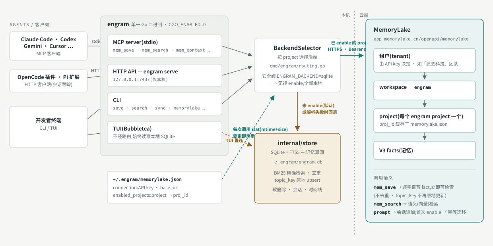

# Engram 安装指南(中文)

Engram 是给 AI 编码 agent 用的持久记忆服务。本文只保留必须操作:**安装**和**开启 MemoryLake project 功能**。

## 一、安装

一条命令完成「二进制安装 + Claude Code 插件接入」(macOS / Linux,自动使用最新版本;升级 = 重跑同一条命令):

```bash
curl -fsSL https://raw.githubusercontent.com/relytcloud/engram/main/install.sh | bash
```

若提示 `engram: command not found`,把 `~/.local/bin` 加入 PATH:

```bash
echo 'export PATH="$HOME/.local/bin:$PATH"' >> ~/.zshrc   # bash 用户改 ~/.bashrc
exec $SHELL
```

验证并生效:

```bash
engram version    # 打印版本号即安装成功
```

然后**重启 Claude Code**,新会话里能看到 `mem_*` 工具即接入成功。

## 二、开启 MemoryLake project 功能

**什么是 project**:project 是记忆的隔离单位——每条记忆归属一个 project,保存、搜索、加载上下文都只在该 project 范围内进行,MemoryLake 也是按 project 逐个开启。

**project 名怎么得出**:不显式指定时,engram 根据当前目录自动检测,通常就是 **git 仓库名**(优先取 git remote 里的仓库名,没有 remote 就用仓库根目录名;不在 git 仓库里则用当前目录名),并统一转为小写。例如在 `~/code/Engram` 仓库里工作,project 就是 `engram`。也可以在命令里用 `--project <名>` 显式指定;用 `engram projects list` 可查看本机已有的所有 project。

默认所有 project 用本地 SQLite。只有显式 enable 的 project 才改用 MemoryLake,其余不受影响。

### 1) 获取 API key

1. 打开 [MemoryLake 控制台](https://app.memorylake.cn) 并登录;
2. 点击左上角团队切换器,选择**「质变科技」**团队(API key 决定记忆写入哪个团队/租户,选错团队则记忆互不可见);
3. 进入 **API Keys** 页面,点击 **Create API Key**;
4. **立即复制保存**生成的密钥(`sk_` 开头)——密钥只在创建时显示一次,之后无法再查看。

### 2) 配置 API key(一次即可)

```bash
engram memorylake config --api-key "sk_你的APIKey"
```

> 服务端默认为 `https://app.memorylake.cn/openapi/memorylake`,无需配置。

### 3) 对 project 启用

```bash
engram memorylake enable --project <project名>
```

首次 enable 会自动把该 project 在本地 SQLite 中的已有记忆迁移到 MemoryLake(幂等,可重复执行)。enable / disable 对**正在运行的 agent session 也即时生效**,无需重启。

### 4) 查看 / 关闭

```bash
engram memorylake status                          # 查看各 project 当前后端,含逐轮同步开关
engram memorylake disable --project <project名>   # 改回本地 SQLite
```

### 5) 开启逐轮对话同步(可选)

对已 enable 的 project,可以让每一轮问答在结束时自动写入 MemoryLake,由云端抽取成记忆 —— 不再依赖 agent 主动调用 `mem_save`。

**先读下面的"注意"再决定开不开**,尤其第一条:这个开关会把你输入的内容自动送出本机。

```bash
engram memorylake conversations enable  --project <project名>   # 开
engram memorylake conversations disable --project <project名>   # 关
engram memorylake status                                        # 验证
```

和上面的 enable / disable 一样,**开关即时生效,运行中的 agent session 无需重启**。

`status` 的输出里,该 project 那一行末尾会显示当前状态:

```
  myproject   memorylake  (proj_id=proj-xxxx, enabled_at=2026-08-18T..., conversations=on)
```

之后照常用 Claude Code 对话就行。**这个功能对对话完全透明** —— 不需要任何额外操作,也不会在对话里看到任何提示,所以"看起来什么都没发生"才是正常的。想确认有没有写入失败,看 `~/.engram/logs/turn.log`:**成功时不写日志**,所以这个文件为空、或者压根不存在,就说明一切正常。

关闭只停止逐轮写入,已经写进 MemoryLake 的内容不会被删除,该 project 的 MemoryLake 后端本身也不受影响(要改回本地 SQLite 用上面第 4 步的 `memorylake disable`)。

**注意**(完整列表见 `DOCS.md` 的 "Per-turn conversation sync"):

- **你输入的一切都会逐字、自动上传,没有本地副本,也无法撤回** —— 包括不小心粘进 prompt 里的密钥。工具调用与工具输出本身不采集,但助手回复中引用的文件内容或命令输出会随回复一起上传。
- 仅支持 Claude Code。被 ESC 打断的轮次不入库;写入失败的轮次直接丢弃,只在 `~/.engram/logs/turn.log` 留一行记录。

## 三、架构总览



数据流:agent → engram 接口层(MCP / HTTP / CLI / TUI)→ 按 project 路由 → 本地 SQLite(默认、真源)或云端 MemoryLake(仅已 enable 的 project)。enable 列表变更即热重载,运行中的 session 无需重启;`ENGRAM_BACKEND=sqlite` 可强制全部走本地。

## 参考

完整安装方式(手动安装、源码编译、Windows)、升级说明、API / CLI / 环境变量:见仓库根 `DOCS.md` 与 [Releases](https://github.com/relytcloud/engram/releases)。
